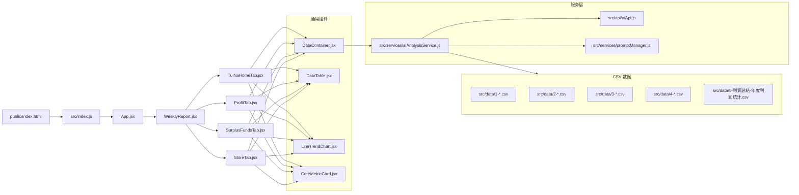

# 常乐经营管理周报系统

## 项目概述
- 业务目标：构建经营管理周报看板，支持总部与城市维度的营运分析、财务分析与AI洞察，提供决策所需核心指标与维度拆解。
- 技术定位：React 18 + Webpack 5 的纯前端单页应用；数据以 CSV 文件为主，内置 AI 分析服务用于生成自然语言洞察。

## 架构图解


## 核心模块说明
- 看板主组件：`src/components/WeeklyReport.jsx` 用于组织顶层 Tab 与内容切换
- 业务子模块：
  - 推拿之家：`src/components/TuiNaHome/index.jsx` `src/components/TuiNaHome/*`
  - 利润：`src/components/ProfitTab.jsx`
  - 结余资金：`src/components/SurplusFundsTab.jsx`
  - 门店：`src/components/StoreTab.jsx`
- 通用组件：`src/components/Common/*` 提供数据容器、表格、趋势图与核心指标卡片
- 数据工具：`src/utils/dataLoader.js` 提供 CSV 解析与筛选工具
- AI服务：
  - `src/services/aiAnalysisService.js` 负责数据预处理、提示词构建与缓存
  - `src/api/aiApi.js` 统一封装 Chat Completions 调用，支持提供商切换
  - `src/services/promptManager.js` 管理不同文件的分析提示词模板

## 环境配置指南
- Node：建议 `>=16`（推荐 `18`）
- 安装：`npm install`
- 开发：`npm start`（Webpack Dev Server，端口 `8000`）
- 构建：`npm run build`（输出 `dist/bundle.js` 与模板 `index.html`）
- 环境变量：`REACT_APP_AI_API_KEY`（浏览器环境注入，供 `aiApi.js:37-41` 使用）
- 数据访问：Dev Server静态目录含 `public/` 与 `src/data/`（`webpack.config.js:31-40`）

## 部署流程（含 CI/CD）
- 构建产物：`dist/` 目录（`webpack --mode production`）
- 部署目标：任意静态资源托管（Nginx/OSS/Netlify/GitHub Pages）
- 参考 CI 配置（GitHub Actions）：
```yaml
name: build-and-deploy
on:
  push:
    branches: [ main ]
jobs:
  build:
    runs-on: ubuntu-latest
    steps:
      - uses: actions/checkout@v4
      - uses: actions/setup-node@v4
        with:
          node-version: '18'
      - run: npm ci
      - run: npm run build
      - name: Upload artifact
        uses: actions/upload-artifact@v4
        with:
          name: dist
          path: dist
```

## API 文档索引
- `src/api/aiApi.js`
  - `setApiKey(apiKey)` 设置密钥
  - `setConfig(config)` 设置模型与超时等配置
  - `switchProvider(provider, config)` 切换提供商
  - `analyze(prompt, options)` 发送分析请求（`/chat/completions`）
- `src/services/aiAnalysisService.js`
  - `loadDataFile(filePath)` 读取 CSV
  - `preprocessData(data, maxRows)` 预处理并限制行数
  - `buildAnalysisPrompt({data,promptTemplate,context})` 构建提示词
  - `analyzeSingleFile(filePath, promptTemplate, options)` 单文件分析
  - `analyzeMultipleFiles(fileConfigs, promptTemplate, options)` 多文件联合分析
  - `clearCache()` 清除分析缓存
- `src/services/promptManager.js`
  - `getPrompt(fileName)` 获取模板（文件名匹配或默认）
  - `setPrompt(fileName, promptTemplate)` 设置/更新模板
  - `removePrompt(fileName)` 删除模板
  - `getAllPrompts()` 列出所有模板

## 版本变更记录
- 当前版本：`v4.1-arch-review`
- 变更摘要：
  - 清理历史/临时/重复文件，统一入口为 `src/index.js`，模板为 `public/index.html`
  - 移除未使用的 TS 原型文件与重复组件副本，详见 `docs/file-cleanup-report.md`
  - 业务模块重构：将 `src/components/TuiNaHome` 重命名为 `src/components/TurnoverReport` 以对齐"营业额"业务域
  - README 重构为架构与技术评审格式，术语与实现一一对应

## 安装与运行
- 安装依赖：`npm install`
- 启动开发：`npm start`
- 构建生产：`npm run build`
